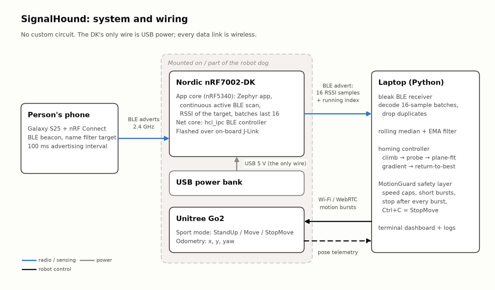
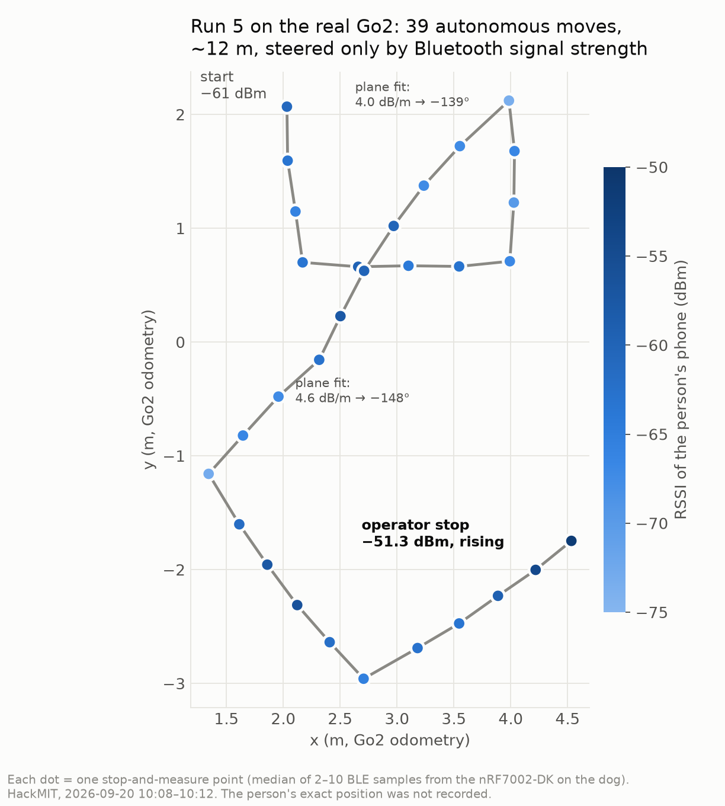

# SignalHound

**A robot dog that finds a person by radio signal, even when it can't see them.**

A Nordic nRF7002-DK riding on a Unitree Go2 measures the Bluetooth signal strength (RSSI) of the person's phone. The dog takes a step, stops, measures again and climbs the signal until it reaches them. It uses no cameras, no map and no GPS.

Built at HackMIT 2026 by Aryan Raj and Ray Apinyanon. 1st place, Hackster "Create What's Next" challenge.



## Results



In our last run on the real Go2, the dog made **39 autonomous moves over ~12 m**, steered only by RSSI from the Nordic board. It was closing in at **−51.3 dBm and rising** when the operator stopped it. The full write-up has the run-by-run results, the simulator matrix and what we learned: [docs/hackster/hackster-writeup.md](docs/hackster/hackster-writeup.md).

Honest status: the dog never formally declared TARGET FOUND on hardware. The Go2 was borrowed for the event, and we returned it before we could test the final stop rule on the dog.

## How it works

1. **Firmware** ([firmware/nordic/signalhound_scanner](firmware/nordic/signalhound_scanner)): a Zephyr app on the nRF5340 app core scans continuously and records the target phone's RSSI. It rebroadcasts its last 16 samples plus a running index in its own BLE advertisement, so the laptop needs no cable to the dog. The net core runs the upstream `hci_ipc` controller.
2. **Radio layer** ([signalhound/radio](signalhound/radio)): BLE (bleak) or serial input, rolling median + EMA filter, staleness tracking.
3. **Homing controller** ([signalhound/homing](signalhound/homing)): an explicit state machine. It climbs the signal, probes new headings when the signal goes flat, fits a plane to recent odometry + RSSI points to steer along the gradient, and returns to the strongest spot when it overshoots.
4. **Safety** ([signalhound/robot/safety.py](signalhound/robot/safety.py)): every motion goes through one guard, with short bursts, hard speed caps, a stop after every burst, a latched STOP on any error, and limits on search time and move count.
5. **Go2** ([signalhound/robot/go2.py](signalhound/robot/go2.py)): Unitree WebRTC data channel (StandUp, BalanceStand, Move, StopMove, odometry telemetry).

## Try it without hardware

The simulator models path loss, noise, packet loss and multipath ripple:

```bash
python3 -m venv .venv && . .venv/bin/activate
pip install python-dotenv pytest
python scripts/homing_auto.py --mock --yes      # simulated search; ends with TARGET FOUND
python -m pytest tests_sh -q                    # 17 SignalHound tests
```

## On real hardware

- Flash the DK (both cores, over J-Link): `scripts/flash_nordic.sh`. Setup details: [docs/nordic-setup.md](docs/nordic-setup.md).
- Go2 connection and networking: [docs/go2-setup.md](docs/go2-setup.md).
- Step-by-step field procedure: [docs/field-runbook.md](docs/field-runbook.md).
- Every hardware run, with what we changed after it: [docs/experiment-log.md](docs/experiment-log.md).
- Run: `cp .env.example .env`, fill in the Go2 values, then `./scripts/demo.sh`. Ctrl+C always stops the dog.

## Repository layout

| Path | What |
|---|---|
| `signalhound/` | radio, homing controller, robot + safety layers |
| `firmware/nordic/` | Zephyr scanner source + prebuilt hex files |
| `scripts/` | demo, field tests, radio monitor, flashing, network helpers |
| `tests_sh/` | SignalHound tests |
| `docs/hackster/` | write-up, figures and the scripts that generate them |
| `recall_rover/`, `apps/`, `tests/` | our earlier HackMIT idea, kept for history (see [legacy/](legacy/README.md)) |
