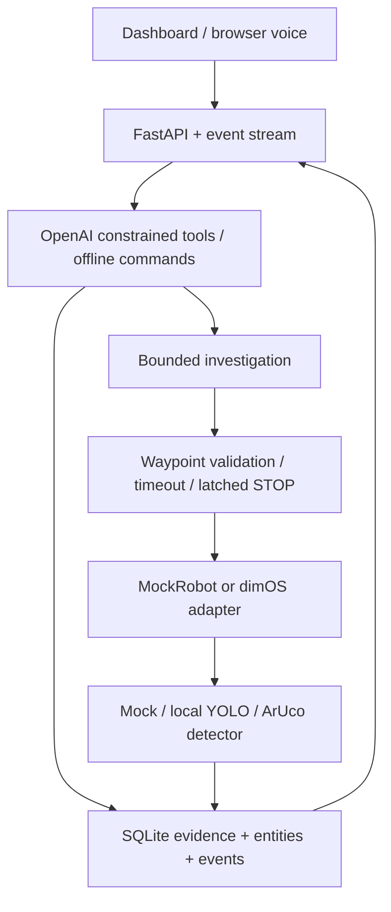

# Recall Rover architecture

The loop is observe → remember → physically check → invalidate on a successful negative
inspection → bounded search → rediscover → update. Moving mock ground truth does not change memory.

SQLite preserves all observations, invalidations, and change links. Effective confidence decays
with age. A stable simulator/tag ID supports confident MOVED events. Ordinary detector boxes use
conservative short-term IoU association; cross-zone same-class detections are candidates, not
proof that the same personal object moved. No cloud calls happen in continuous perception.

Only constrained tools reach Safety. Motion is serialized and bounded; STOP latches independently
of task locks. The dashboard receives public action/result events, not hidden model reasoning.
Hardware adapter fails closed when safe actuation cannot be guaranteed. Services run on loopback;
remote deployment needs authenticated access, not a public unprotected robot API.

## Entity association (how "is this the same backpack?" is decided)

1. **Registered identity** (mock truth or an ArUco ID): exact match; class may not change.
2. **Same-view continuity**: same zone, within 30 s, box IoU > 0.3, and not the same frame.
3. **Appearance**: cosine similarity of a 128-bin HSV histogram of the crop. Match if ≥ 0.85 and
   the runner-up is at least 0.05 lower. If candidates tie, link only when the tied candidate is
   already in this zone (REOBSERVED is safe); a cross-zone tie creates a new candidate rather than a
   fabricated MOVED. Detections sharing a frame id are never merged.
4. Otherwise a new entity (APPEARED).

Zones come from the robot: observer pose → nearest surveyed waypoint (Go2, mock) or bbox centre →
image third (stationary webcam). Neither is an object coordinate; the UI says so.

## Robot backends

| Backend | Sensing | Motion | Use |
|---|---|---|---|
| mock | scripted world | simulated, instant | tests, deterministic demo |
| webcam | real frames from a fixed camera | none (attention only) | real-perception demo without the dog |
| dimos | Go2 camera/odometry via `Dimos.connect()` | planner goals + bounded twists | the real thing |
