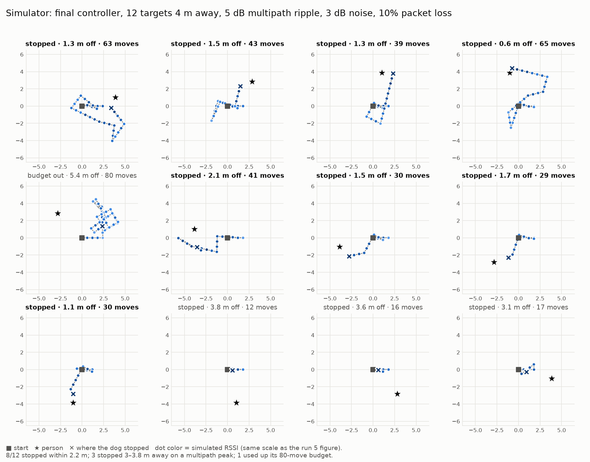
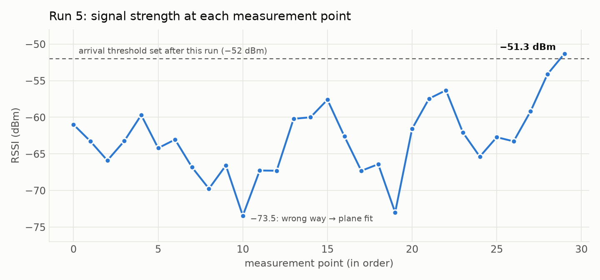

# SignalHound: a robot dog that finds people by radio

**One-line summary:** A Unitree Go2 carrying a Nordic nRF7002-DK homes in on a person using only the Bluetooth signal strength of their phone. It uses no cameras, no map and no GPS: the dog moves, measures again, and climbs the signal gradient.

> Built in 24 hours at HackMIT 2026 by Aryan Raj and Ray Apinyanon. The Go2 was borrowed from a sponsor for the event and has been returned, so everything below is data logged during the hackathon.

---

## Components

**Hardware**
- Unitree Go2 quadruped (borrowed for the event)
- Nordic nRF7002-DK (nRF5340 dual-core SoC): the BLE receiver riding on the dog
- USB power bank (powers the DK, so the dog carries no cable)
- Android phone (Galaxy S25) running nRF Connect as the BLE beacon, set to a 100 ms advertising interval
- Linux laptop (runs the controller, talks to the dog over its Wi-Fi)

**Software**
- Zephyr RTOS v4.2.0 (upstream) + Zephyr SDK 0.17.4
- SEGGER J-Link (flashing both nRF5340 cores)
- Python 3: `bleak` (BLE), `pyserial`, `unitree_webrtc_connect` (Go2 WebRTC data channel)

---

## The idea

Phones broadcast Bluetooth all the time. If someone carries a phone, the radio can find them where cameras can't: around corners, behind obstacles, in the dark. But RSSI (received signal strength) is a single number. It tells you *how strong*, not *which way*. SignalHound gets direction the same way a dog follows a scent: move, sniff again, compare.

## System architecture

```
[Phone BLE beacon] --2.4 GHz--> [nRF7002-DK on the dog]
                                   app core: Zephyr active scanner, name filter,
                                             batches last 16 RSSI samples
                                   net core: hci_ipc BLE controller
                                        |
                                        | BLE advertisement (manufacturer data, 'SH' magic)
                                        v
                                [Laptop, Python]
                                   radio layer: rolling median + EMA filter
                                   homing controller (state machine)
                                   MotionGuard (speed caps, burst limits, stop latch)
                                        |
                                        | WebRTC data channel (Wi-Fi)
                                        v
                                [Unitree Go2]  StandUp / BalanceStand / Move / StopMove,
                                               odometry telemetry back to the laptop
```


### Firmware (nRF7002-DK)
- **App core:** a Zephyr application that scans continuously (100% scan window), keeps advertisers whose name matches the target, and records RSSI.
- **Cable-free link:** Linux's BlueZ stack only surfaces about one advertisement update per device every ~2 s. To work around this, the DK packs its **last 16 RSSI samples plus a running index** into its own advertisement's manufacturer data. The laptop decodes the batch and drops duplicates, getting ~1.2 samples/s with no USB cable to the dog.
- **Net core:** the upstream `hci_ipc` controller sample.
- Flashed over J-Link. The board's drag-and-drop programmer does not work on the nRF5340, so both cores are programmed directly.

### Laptop
- **Radio layer:** serial or BLE input, rolling median + exponential moving average, staleness and quality tracking.
- **Go2 layer:** the Unitree WebRTC data channel for sport-mode commands and live telemetry (position, yaw, velocity).
- **MotionGuard:** every command goes through one safety layer: small fixed-length velocity bursts, hard speed caps, an explicit stop after every burst, a latched STOP on any exception, Ctrl+C stops the dog, and limits on total search time and number of moves.
- **Homing controller:** an explicit state machine (calibrate → advance → probe/turn → gradient steer → return-to-best → arrived), with a terminal dashboard showing live RSSI, filtered value, pose, state and every decision.

## The algorithm

1. **Calibrate:** stand still and take a baseline RSSI median.
2. **Advance:** take a 0.6 m step, stop, re-measure. If the signal improved, keep going.
3. **Probe:** if the signal is flat or worse for a few steps, turn and probe a new heading.
4. **Gradient steering (plane fit):** once the dog has moved in two directions, fit `RSSI ≈ a·x + b·y + c` to the last 12 odometry + RSSI points and steer along `(a, b)`. Averaging over *space* is what defeats multipath; averaging over time in one spot doesn't.
5. **"Passed it" reflex:** once the best reading is strong (≥ −60 dBm), a drop of ≥ 4 dB means the dog overshot. It returns to the best spot by odometry and stops there if the reading is ≥ −55 dBm.
6. **Arrive:** stop at ≥ −52 dBm.


### Simulator
Before each change went on the dog, we tested it in a 2D radio simulator with log-distance path loss, 3–5 dB noise, 10% packet loss and a ±5 dB position-dependent multipath ripple model. Each tuning choice was decided by a 12–16 case convergence matrix:

| Change | Result in simulation |
|---|---|
| Plain sweep, 3-step probes | 16/16 found (36 moves) |
| Shorter post-turn probes | 15/16, with 8 m runaways |
| Two-sided probing | 11–14/16, with 12–17 m runaways (rejected) |
| Plane-fit steering (5 dB ripple) | 10/12 → **12/12** found; 44 → 36 moves; worst wander 8.4 → 4.0 m |
| "Passed it" reflex + recalibrated levels | **12/12** found, mean stop distance 1.4 m |

Those numbers come from our hackathon log. After the event we reran the final controller on a harder set of cases: 12 targets 4 m away in every direction, 5 dB ripple, 3 dB noise, **and 10% packet loss**:


*8 of 12 searches stopped within 2.2 m of the person. In 3, a multipath peak near the start fooled the "passed it" rule, and the dog stopped 3–3.8 m away. One used up its 80-move budget. The false early stops are the main thing we'd fix next. A directional antenna (see What's next) is the most direct fix.*

---

## Testing and results (real hardware)

### RSSI vs. situation (phone at 100 ms advertising interval)
191 samples over 115 s:

| Situation | Median RSSI | Spread |
|---|---|---|
| Phone touching the DK | −22 to −24 dBm | ±1 dB |
| Arm's length | −38 to −41 dBm | ±3 dB |
| On a nearby table | −57 to −62 dBm | ±5 dB |
| Walking away around the hall | −75 → −86 dBm | ~1 packet / 5 s |

Takeaway: below about −78 dBm, packets go missing rather than just getting weaker, so the controller has to treat silence and a weak signal differently.

### Motion primitives on the Go2
- Forward burst (0.2 m/s × 0.5 s): moved **0.10 m**, clean stop.
- Rotate burst (0.5 rad/s × 0.5 s): turned **~8°** (~55% of nominal because the dog ramps up), drift < 2 cm.

### Field runs: what each one taught us

| Run | Setup | What happened | What we changed |
|---|---|---|---|
| 1 | DK hand-held (not on the dog) | Plumbing worked end to end: radio → decision → burst → stop. Not a valid closed loop. | Accept thin sample windows; only silence counts as "lost". |
| 2 | Phone taped flat on the dog | Baseline −87 dBm: the dog's body and battery cost ~20 dB. 7 mechanically correct moves, no usable signal. | Mount the receiver clear of the body; warn on weak baselines; back up before rotating. |
| 3 | DK + power bank on the dog, BLE link, person holding the phone | Healthy −68 dBm baseline. Forward was flat, so it turned left, and the left probe got +6 dB. | Learned that the first turn with one omnidirectional antenna is a coin flip, so we made wrong guesses cheap instead of trying to avoid them. |
| 4 | Same, climb mode | 16 moves, ~6 m, walked a loop. RSSI rippled −60 to −73 dBm with no consistent gradient: indoor multipath. | Added plane-fit gradient steering. |
| 5 | Same + gradient steering | **39 autonomous moves, 3.8 min, ~12 m.** Boxed around the person, with peaks of −56 to −51 dBm within ~1–2 m on several passes. Stopped by the operator at **−51.3 dBm and rising**. | A hand-held phone is body-shadowed by 10–20 dB, so the −45 dBm arrival threshold was never reachable. Set arrival to −52 dBm and added the "passed it" return-to-best reflex. |


*Run 5 plotted from the Go2's own odometry. Each dot is a stop-and-measure point colored by the RSSI the Nordic board measured there. You can see both plane-fit turns. The final leg climbs steadily from −63 to −51.3 dBm.*


*The same run as a time series. The signal swings ±6 dB from one step to the next (multipath), but the trend over the run goes from −61 dBm to −51.3 dBm.*

**Honest status:** the dog's motion was driven entirely by live RSSI from the Nordic board, on real hardware. It never formally declared TARGET FOUND on hardware: run 5 was stopped while the dog was closing in, and we had to return the dog before testing the final stop rule (which passed 12/12 in simulation).

---

## Challenges
- The DK's console is on the **second** J-Link virtual COM port.
- Enabling extended advertising in the host made scanning fail against the upstream controller (`-EIO`).
- The Go2's access point gets a new name on every boot and has no internet. We routed internet over a phone USB tether with a pinned default route.
- A power bank kept switching itself off under the DK's tiny load.
- Physics: at 4 m indoors, ±5 dB multipath ripple hides a ~2 dB/m gradient.

## What we learned
- RSSI is a noisy scalar field, not a range measurement.
- Time-averaging fixes packet noise, not multipath. Only moving does.
- Stop criteria matter as much as the search.
- Simulate before you move a robot. Most of our tuning came from a ~200-line mock.

## What's next
- A foil reflector behind the antenna for a directional pattern ("spin, sniff, go"). Our simulator says 8 dB of front/back contrast takes convergence from 20% to 90%.
- A second receiver for true bearing estimation.
- Frontier-style exploration for larger spaces; obstacle avoidance using the Go2's sensors.
- Porting the controller to the AMD Kria robotics platform.

## Code
- GitHub: https://github.com/ary4nraj/hackmit
- Firmware: `firmware/nordic/signalhound_scanner`
- Controller: `signalhound/homing/`, safety: `signalhound/robot/safety.py`
- Simulator demo: `./scripts/demo.sh --mock --yes`
